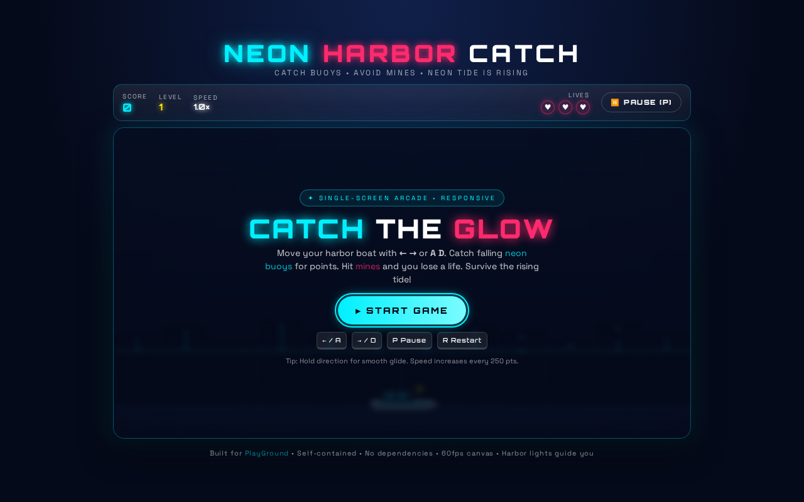
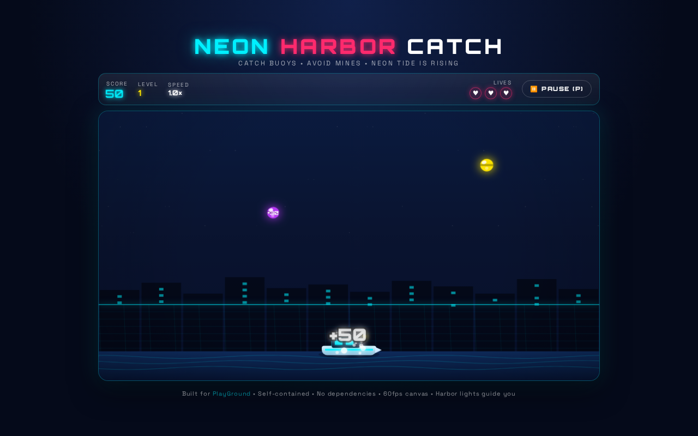

# PlayGround — Neon Harbor Catch

Polished single-screen arcade: move the harbor boat left/right (←→ / A/D, touch drag + buttons) to catch neon buoys and avoid mines. Score, 3 lives, level & speed ramp every 250 pts (1.0×→2.6×, spawn 0.85s→0.38s), start/pause/restart flow, responsive 16:9→4:3→1:1, self-contained.

## Play
Open `index.html` — no build. Or `python3 -m http.server` and visit http://localhost:8000

Controls: **← → / A D** move, **P/Esc** pause, **R/Enter/Space** start/restart, drag boat on canvas, on-screen ◀▶ on mobile.

## Stack
- Single `index.html` (HTML+CSS+JS, ~33KB), Canvas 920×518, 60fps rAF
- WebAudio bleeps, particles + world-space floating score pops (26px stroked Orbitron), screen shake, hit flash
- LocalStorage high score

## Verification
Verified in real Chromium via Playwright (`screenshots/`): start overlay, playing, catch pop (+30/+50 stroked), mine HIT! flash, game over, mobile. Gameplay loop `start→playing→pause↔resume→over→restart` validated.

## Credits
Playground for browser game experiments
