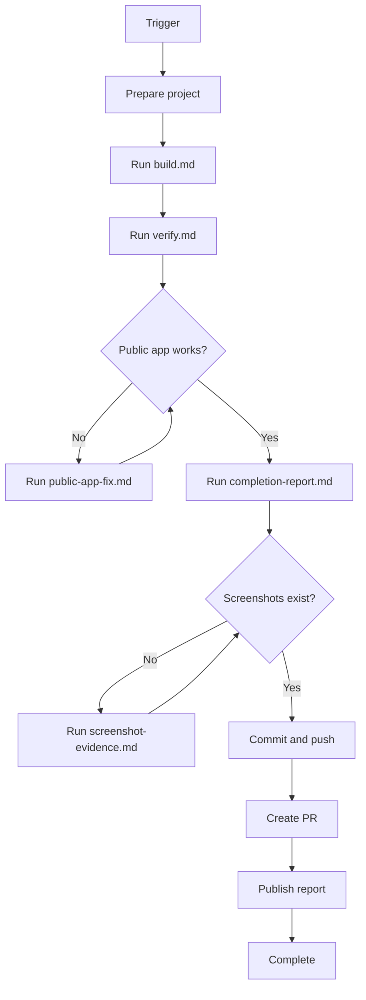

<div align="center">

# 🤯 OMG — Oh My GitHub

### 🚀 One Prompt In. A Full Game or App Out. 🚀

[](https://github.com/AgentsLoop/OhMyGithub/actions)
[](https://github.com/AgentsLoop/OhMyGithub/issues)
[](https://github.com/AgentsLoop/OhMyGithub/actions)
[](https://opencode.ai/)

```text
╔══════════════════════════════════════════════════════════════╗
║  DESCRIBE IT  →  BUILD IT  →  TEST IT  →  PLAY IT           ║
║                                                              ║
║  One GitHub issue. One prompt. A complete project.           ║
╚══════════════════════════════════════════════════════════════╝
```

**No API keys to configure. No server to maintain. No local setup maze.**

</div>

---

## 🤯 What Is OMG?

> **Your GitHub issue becomes the product brief.**

OMG (Oh My GitHub) is an automated GitHub Actions workflow for creating complete browser games and app projects from one natural-language prompt.

Write what you want in an issue and add the `OpenCode` label. OpenCode checks out the project, uses the shared skills, builds the experience, runs tests, verifies the result, and opens a pull request with the finished work.

Yes, it creates the code. Yes, it runs the verification loop. Yes, it can expose the result in a temporary browser URL.

## 🧠 TL;DR

1. Open a GitHub issue.
2. Describe the game or app you want.
3. Add the `OpenCode` label to the issue.
4. Let GitHub Actions build, test, verify, and propose the result.

```text
Your idea → GitHub issue → OpenCode → tests → verified app → pull request
```

## ⚡ Quick Start

Create an issue in your repository with a concrete request:

```text
Build a neon asteroid game.

Requirements:
- Arrow-key movement
- Score and restart button
- Win and lose states
- Responsive browser layout
- Run tests and verify it in a browser
```

That is the whole user-facing workflow. GitHub Actions handles the runner, OpenCode handles implementation, and the workflow handles the verification and pull request.

To run against an existing non-default branch, end the issue title with a
`branch: <name>` directive. The directive selects the checkout and pull-request
base and is removed before the issue body is sent to OpenCode:

```sh
gh issue create \
  --repo AgentsLoop/OhMyGithub \
  --title "Custom branch smoke test branch: codex/omgithub-site" \
  --body "Build a tiny browser page." \
  --label Goal \
  --label OpenCode
```

The GitHub App validates the branch before dispatching. If the directive is absent,
the repository default branch remains the target.

## 🌍 What Can You Build?

| 🎯 Use case | ✨ Example |
|---|---|
| 🎮 Arcade games | Breakout, Space Invaders, Asteroids, Match-3 |
| 🧩 Puzzle games | Word games, logic puzzles, card games |
| 🏃 Interactive demos | Physics experiments, simulations, visual toys |
| 📊 Dashboards | Filters, charts, status panels, analytics views |
| 🛠️ Internal tools | Trackers, generators, small workflow apps |
| 🌐 Landing pages | Product pages, portfolios, interactive showcases |
| 🧪 Prototypes | Turn a product idea into a runnable proof of concept |
| 📱 Browser apps | Responsive tools that work on desktop and mobile |

## 🧰 What Happens Automatically?

> **The workflow is the product.**

- 📥 Checks out your repository and the shared OpenCode skills.
- 🏷️ Synchronizes `model/*` and `skill/*` labels.
- 🧭 Reads issue labels to select the model and requested skills.
- 🤖 Runs OpenCode against the current project.
- 🧪 Runs a second verification prompt after implementation.
- 🌐 Starts the app and checks the local runtime.
- 🔗 Creates a temporary public preview URL when verification passes.
- 🔀 Creates an `opencode/<run-id>` branch and pull request.
- 💬 Posts progress and access details back to the issue.
- 🧹 Cleans up temporary tunnels and runner processes.

## 🏷️ Model and Skill Labels

Labels let you control the workflow without editing YAML.

```text
model/opencode/muse-spark-1.3-contributor-free
skill/load-sketchfab-threejs
skill/gauntlet-loop
```

The workflow validates the selected labels, passes them into OpenCode, and records the resolved model and skills in the run logs. Shared skills are discovered from:

```text
.agents/skills/<skill-name>/SKILL.md
```

## 🔄 OpenCode Workflow



## 🏗️ Architecture

```text
┌──────────────┐     ┌─────────────────┐     ┌──────────────┐
│ GitHub issue │ ──▶ │ GitHub Actions  │ ──▶ │   OpenCode   │
│ + issue text │     │ runner + labels │     │ + .agents    │
└──────────────┘     └─────────────────┘     └──────┬───────┘
                                                    │
                              ┌─────────────────────┼─────────────────────┐
                              ▼                     ▼                     ▼
                         Build code           Run tests             Verify app
                              │                     │                     │
                              └─────────────────────┼─────────────────────┘
                                                    ▼
                                      ┌────────────────────────┐
                                      │ PR + temporary preview │
                                      └────────────────────────┘
```

## 🔐 Security and Access

- 🔑 You do not need to create or store a project-specific AI API key.
- 🖥️ You do not need to operate a dedicated build server.
- ☁️ Execution happens in GitHub Actions.
- 🔒 Temporary SSH and preview access exists only for the workflow run.
- 👀 Review the generated pull request before merging.
- 🛡️ Restrict who can apply the `OpenCode` label in repositories that accept public issues.

> “No servers needed” means no servers for you to provision or maintain. The workflow still uses GitHub-hosted Actions infrastructure and temporary workflow services.

## 📁 Project Structure

```text
📦 OMG
 ├─ .github/workflows/opencode.yml  # 🤖 Main issue-to-project workflow
 ├─ wiki/opencode.md                # 📖 Workflow and session notes
 ├─ wiki/testing.md                 # 🧪 Verification guidance
 └─ AGENTS.md                       # 🧭 Repository instructions
```

## 🧪 Local Validation

Validate the workflow definition before pushing changes:

```sh
actionlint .github/workflows/opencode.yml
git diff --check
```

## 🐛 Troubleshooting

| Problem | What to check |
|---|---|
| The workflow did not start | Confirm the `OpenCode` label is applied to the issue. |
| A skill was not selected | Add a matching `skill/<name>` label. |
| The app URL is missing | Check the local app verification step and runner log. |
| The PR was not created | Confirm OpenCode produced a diff and the workflow reached the PR step. |
| The workflow ran unexpectedly | Tighten the trigger condition and trusted-user policy. |

## 🤝 Contributing

Ideas, skills, game templates, verification improvements, and workflow fixes are welcome.

1. Open an issue describing the improvement.
2. Add the `OpenCode` label when you want the workflow to prototype it.
3. Review the generated pull request carefully.
4. Add tests and runtime proof for workflow changes.

## ⭐ The Pitch

The old workflow was: idea → tickets → scaffolding → setup → implementation → debugging → deployment.

The OMG workflow is: **idea → issue → playable project.**

If you believe software should start with a sentence instead of a sprint plan, [⭐ star the repository](https://github.com/AgentsLoop/OhMyGithub) and try it.

<div align="center">

**Built with GitHub Actions, OpenCode, shared skills, and unreasonable optimism.** 😏

</div>
